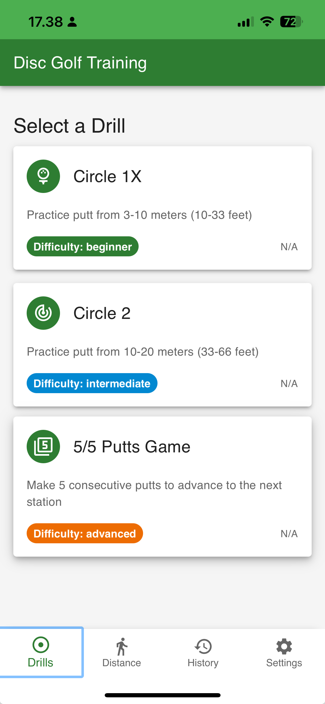

# Disc Golf Training PWA



A Progressive Web App for disc golf putting practice and training. This application helps disc golfers track their putting sessions, measure distances, and improve their game - all while working offline on the course.

## Features

- **Progressive Web App**: Installable on mobile devices with offline functionality
- **Putting Drills**: Track putting practice sessions and success rates with multiple drill types
  - Circle 1X (3-10m) practice
  - Circle 2 (10-20m) practice
  - 5/5 Putts game
- **Distance Tracker**: Comprehensive solution for measuring distances on the course
  - Hardware step sensor support (when available)
  - Accelerometer-based step detection fallback
  - Calibration for stride length
  - Step counting and distance calculation
- **Offline Support**: Full functionality without an internet connection
- **Responsive Design**: Works on all devices and orientations
- **Practice History**: View and filter your past putting sessions
- **Data Management**: Control your locally stored data with statistics and data clearing options

## Tech Stack

- **Frontend**: React 19+ with TypeScript
- **UI Framework**: Material UI (MUI) v7
- **Build Tool**: Vite 6+
- **PWA Support**: vite-plugin-pwa with Workbox
- **Routing**: React Router v7
- **Storage**: IndexedDB with Dexie.js 4
- **Motion Detection**: DeviceMotionEvent API and hardware step sensors

## Mobile UI Best Practices

This app follows modern mobile UI best practices to ensure a great user experience on all devices:

- **Bottom Navigation**: A bottom navigation bar provides easy thumb access to all main app features, following the Material Design guidelines and aligning with how users naturally hold their mobile devices.

- **iOS Safe Area Support**: The app supports iOS safe areas with the viewport meta tag `viewport-fit=cover` and CSS `env(safe-area-inset-bottom)` to ensure proper display on notched iPhones and devices with home indicators.

- **Thumb-Friendly Design**: Key UI elements are placed within easy thumb reach zones to enhance one-handed usability.

- **Adaptive Layout**: The UI adapts to different screen sizes and orientations, ensuring a consistent experience across devices.

- **Responsive Touch Targets**: All interactive elements are sized appropriately (minimum 44x44 pixels) to prevent mis-taps and ensure accessibility.

- **Consistent Navigation**: The app maintains consistent navigation patterns throughout to reduce cognitive load and improve usability.

- **Offline Indicators**: Visual feedback informs users when the app is operating offline, enhancing transparency about the app's state.

## Development Process

Process Description: AI Agent Demo for a Disc Golf Training App

I conducted an AI agent demo using the Cursor editor. The demo was one and a half hours long, so I prepared in advance. First, I conducted a deep research on disc golf training methods and best practices using the Gemini 2.5 Pro language model from Google. This research was aimed at creating a disc golf training app.

Based on the research, I asked the language model to describe a progressive web app (PWA) for a putting practice game. Then, I used a library in the Cursor editor to generate rules and templates for the project requirement document (PRD) and user stories. The Github library ([bmadcode/cursor-custom-agents-rules-generator](https://github.com/bmadcode/cursor-custom-agents-rules-generator)) provided guidance and templates, which I adapted to the project.

I set up the project foundation using Vite with React and TypeScript and deployed it to Vercel for public access. Within one and a half hours, I created a functional disc golf drill game with three training exercises using Google Material Design.

Although my initial idea of measuring putting distance with steps didn't work out immediately, I spent an additional half hour the next day refining the concept. I used the newly released OpenAI gpt-4o model for further guidance, which provided a solid solution that I implemented using Cursor.

The entire process, from research to a fully functioning prototype, took approximately four hours. Overall, it was an efficient and successful demonstration.

## Getting Started

### Prerequisites

- Node.js 16+
- npm or yarn

### Installation

```bash
# Clone the repository
git clone https://github.com/tonihintikka/discgolfputtdemo.git
cd discgolfputt

# Install dependencies
npm install

# Start development server
npm run dev

# For testing on mobile devices on the same network
npm run dev -- --host
```

### Available Scripts

- `npm run dev` - Start development server
- `npm run build` - Build for production
- `npm run preview` - Preview production build
- `npm run lint` - Run ESLint
- `npm run format` - Format code with Prettier

## Deployment

This project can be easily deployed to Vercel:

1. Push your code to a Git repository (GitHub, GitLab, Bitbucket)
2. Import the project in Vercel
3. Vercel will automatically detect it's a Vite project
4. Use default settings:
   - Build Command: `npm run build`
   - Output Directory: `dist`
5. Deploy!

## Project Structure

```
disc-golf-pwa/
├── public/              # Static assets
├── src/
│   ├── components/      # React components
│   │   ├── common/      # Reusable UI components (DistanceDisplay, StanceSelector, DynamicIcon, etc.)
│   │   ├── drills/      # Drill-related components (DrillSelection, ActiveDrill, etc.)
│   │   ├── distance/    # Distance measurement components (DistanceMeter)
│   │   ├── stats/       # Statistics components (PracticeHistory)
│   │   ├── pedometer/   # Pedometer-related components (PedometerDisplay, PedometerSettings)
│   │   └── settings/    # Settings and data management components (DataManagement)
│   │   
│   ├── hooks/           # Custom React hooks (useStepDetector)
│   ├── services/        # Service layer
│   │   ├── storage/     # IndexedDB storage services
│   │   └── pedometer/   # Distance calculation and step detection
│   ├── types/           # TypeScript types (drills, measurements, etc.)
│   ├── pages/           # Page-level components
│   ├── App.tsx          # Main application with routes
│   └── main.tsx         # Application entry point
└── docs/                # Documentation and user stories
    ├── stories/         # User stories for project epics
    └── technical/       # Technical documentation and examples
```

## Offline Capabilities

This PWA works offline through:
- Service Worker caching with Workbox
- IndexedDB for local data storage
- Installable on mobile home screens

## Implemented Features

- Advanced Distance Tracker with hardware sensor support 
- Distance measurement history
- Data management with statistics and clearing options 
- Responsive grid layout for drill selection
- Offline-first architecture with IndexedDB
- Comprehensive putting drill system with multiple practice types
- Multi-language support with English and Finnish translations
- Robust storage service with proper TypeScript typing

## Features in Development

- Statistics visualization with charts
- Backup and export functionality
- User accounts (optional) for cloud sync
- Social sharing of practice results

### Translation To-Do

- **HistoryPage:** Translate 'Unknown Drill' string.
- **PracticeHistory:** Translate 'Failed to load practice history' error and 'Unknown Drill'. Review filter option display.
- **DataManagement:** Translate snackbar messages for data clearing actions and errors. Translate confirmation dialog text/buttons (Cancel, Confirm).
- **PedometerSettings:** Review component for any untranslated labels or descriptions.
- **DrillSummary:** Translate error messages ('No session ID provided', 'Session not found', etc.). Translate table headers and action buttons if needed.
- **DistanceMeter:** Translate 'Could not load calibration data' error. Translate button labels (Start/Stop Tracking, Reset, Calibrate).
- **General UI:** Ensure consistent translation for common words like "Continue", "Confirm", "Error" using `t()`.

## License

MIT

---

Built with ❤️ for disc golfers
