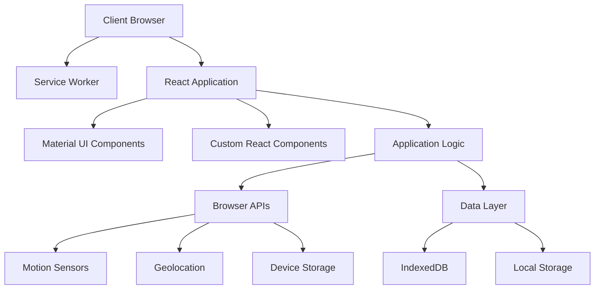
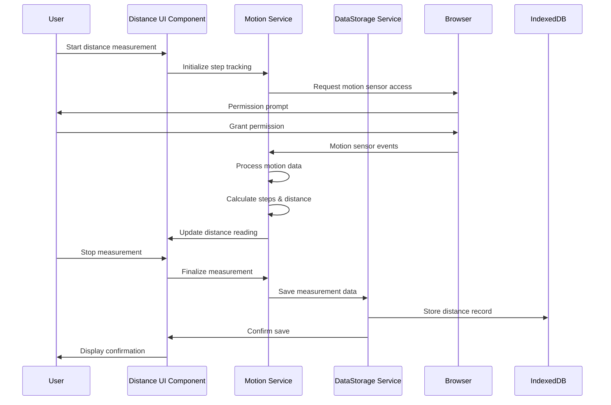
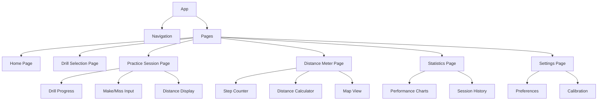
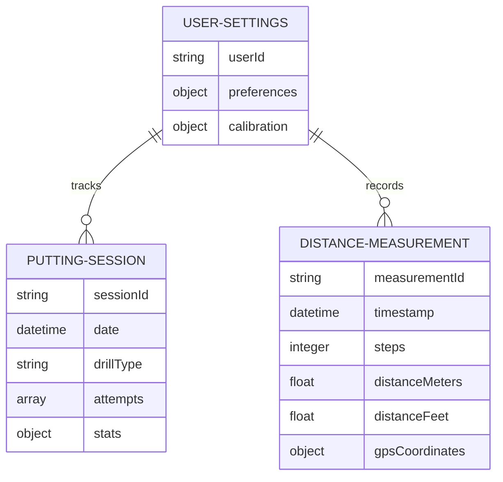

# Architecture for Disc Golf Training PWA

Status: Draft

## Technical Summary

The Disc Golf Training PWA is built using a modern web technology stack centered around React and TypeScript. It follows a Progressive Web App architecture to provide offline capabilities through service workers and local storage (IndexedDB). The application utilizes the Material UI component library for implementing a responsive, mobile-first interface following Material Design principles. The architecture emphasizes client-side computation for features like distance measurement via motion sensors, with data persistence handled locally to support the offline-first approach.

## Technology Table

| Technology | Description |
| ------------ | ------------------------------------------------------------- |
| React | Frontend UI library for building component-based interfaces |
| TypeScript | Statically typed JavaScript for improved code quality and developer experience |
| Material UI | React component library implementing Material Design principles |
| Vite | Modern build tool providing fast development experience and optimized production builds |
| PWA (Workbox) | Tools for generating service workers and enabling PWA capabilities |
| IndexedDB | Browser-based NoSQL database for client-side data persistence |
| Web APIs | Device motion, geolocation, and storage APIs for native device integration |
| Recharts | React-based charting library for visualization of putting statistics |
| React Router | Client-side routing for single-page application navigation |
| Jest/Testing Library | Framework for unit and component testing |

## Architectural Diagrams

### High-Level Architecture



### Data Flow: Distance Measurement



### Component Architecture



## Data Models, API Specs, Schemas, etc...

### Database Structure



### IndexedDB Schema

The application uses three primary object stores in IndexedDB:

1. **settings**
```json
{
  "userId": "string (generated UUID)",
  "preferences": {
    "preferredUnits": "metric|imperial",
    "strideLength": "float",
    "defaultPuttingDistance": "float"
  },
  "calibration": {
    "strideCalibrationDate": "datetime",
    "calibratedStrideLength": "float"
  }
}
```

2. **sessions**
```json
{
  "sessionId": "string (generated UUID)",
  "date": "datetime",
  "drillType": "string",
  "attempts": [
    {
      "distance": "float",
      "result": "hit|miss",
      "stance": "string",
      "notes": "string"
    }
  ],
  "stats": {
    "totalAttempts": "integer",
    "madeAttempts": "integer",
    "makePercentage": "float"
  }
}
```

3. **measurements**
```json
{
  "measurementId": "string (generated UUID)",
  "timestamp": "datetime",
  "steps": "integer",
  "distanceMeters": "float",
  "distanceFeet": "float",
  "gpsCoordinates": {
    "latitude": "float",
    "longitude": "float",
    "accuracy": "float"
  }
}
```

## Project Structure

```
disc-golf-pwa/
├── public/              # Static assets
│   ├── icons/           # App icons for various sizes
│   ├── manifest.json    # PWA manifest file
│   └── serviceWorker.js # Service worker for offline capabilities
├── src/
│   ├── components/      # React components
│   │   ├── layout/      # App shell, navigation, common layout components
│   │   ├── drills/      # Putting drill components
│   │   ├── distance/    # Distance measurement components
│   │   ├── stats/       # Statistics visualization components
│   │   └── common/      # Reusable UI components
│   ├── hooks/           # Custom React hooks
│   │   ├── useMotion.ts # Hook for accessing motion sensors
│   │   ├── useGeo.ts    # Hook for geolocation
│   │   └── useDB.ts     # Hook for IndexedDB operations
│   ├── services/        # Business logic services
│   │   ├── storage/     # IndexedDB operations
│   │   ├── pedometer/   # Step detection and distance calculation
│   │   └── statistics/  # Data analysis for putting performance
│   ├── context/         # React context providers
│   │   ├── SettingsContext.tsx  # User preferences
│   │   └── OfflineContext.tsx   # Network status tracking
│   ├── pages/           # Page components
│   │   ├── Home.tsx     # Landing page
│   │   ├── DrillsPage.tsx       # Drill selection
│   │   ├── PracticePage.tsx     # Active practice session
│   │   ├── DistancePage.tsx     # Distance measurement
│   │   ├── StatsPage.tsx        # Statistics visualization
│   │   └── SettingsPage.tsx     # User settings
│   ├── types/           # TypeScript type definitions
│   │   ├── drills.ts    # Drill type definitions
│   │   ├── measurements.ts # Distance measurement types
│   │   └── stats.ts     # Statistics types
│   ├── utils/           # Helper functions
│   │   ├── conversion.ts # Unit conversion (meters to feet)
│   │   ├── storage.ts   # Storage utilities
│   │   └── validation.ts # Input validation
│   ├── theme/           # Material UI theme customization
│   │   └── theme.ts     # Custom theme definition
│   ├── App.tsx          # Main application component
│   ├── main.tsx         # Application entry point
│   └── vite-env.d.ts    # Vite environment types
├── tests/               # Test files
├── .gitignore           # Git ignore file
├── index.html           # HTML entry point
├── package.json         # Project dependencies
├── tsconfig.json        # TypeScript configuration
├── vite.config.ts       # Vite configuration
└── README.md            # Project documentation
```

## Infrastructure

The Disc Golf Training PWA is designed as a fully client-side application with no dedicated backend infrastructure required for the initial phase. This architectural choice supports:

1. **Simplified Deployment** - Can be hosted on any static web hosting service
2. **Reduced Costs** - No server maintenance or database hosting fees
3. **Offline Functionality** - All features work without internet connectivity

### Hosting Options

For the initial release, we will use one of the following static hosting options:

1. **GitHub Pages** - Free hosting directly from GitHub repository
2. **Netlify** - Modern hosting with integrated CI/CD
3. **Vercel** - React-optimized hosting platform

All these platforms offer:
- SSL certificates for HTTPS (required for PWA and sensor APIs)
- Global CDN for fast content delivery
- Basic analytics

## Deployment Plan

### Development Pipeline

1. **Local Development**
   - Using Vite's development server
   - Real device testing using local network

2. **Continuous Integration**
   - Automated testing on each pull request
   - Type checking and linting

3. **Staging Deployment**
   - Automatic deployment to staging environment on merge to develop branch
   - User acceptance testing (UAT)

4. **Production Deployment**
   - Manual promotion from staging to production
   - Progressive rollout strategy

### Release Strategy

The application will follow a phased release approach:

1. **Alpha Release** (Week 1-2)
   - Core PWA infrastructure
   - Basic UI navigation structure
   - Limited to internal team testing

2. **Beta Release** (Week 3-5)
   - Implemented putting module
   - Distance measurement functionality
   - Limited user testing with selected disc golfers

3. **V1.0 Release** (Week 6)
   - Full feature set
   - Public release
   - Analytics implementation

## Change Log

| Change               | Story ID | Description                                            |
| -------------------- | -------- | ------------------------------------------------------ |
| Initial Architecture | N/A      | Initial architecture document based on PRD requirements | 