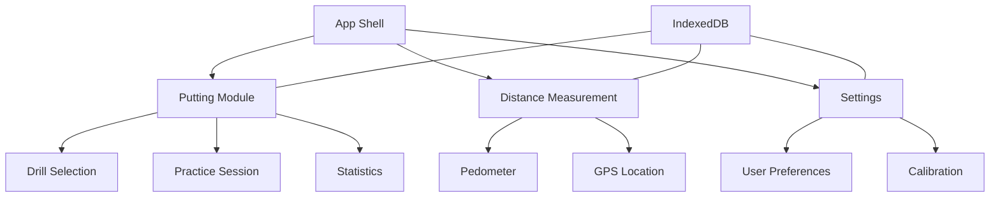
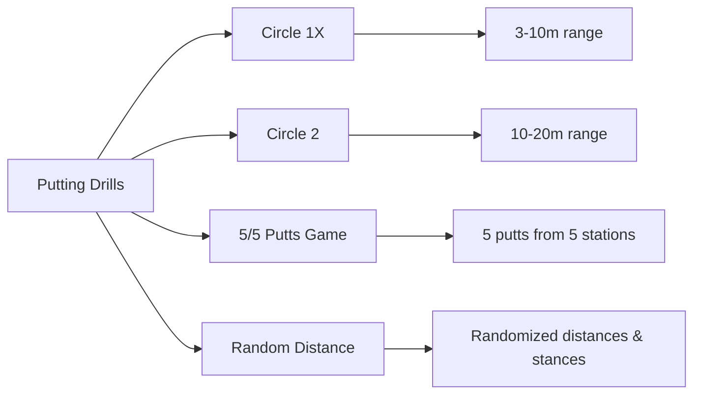

# 1. Title: PRD for Disc Golf Training PWA

<version>1.0.0</version>

## Status: Draft

## Intro

This PRD outlines the development of a Progressive Web App (PWA) for Disc Golf training, initially focusing on a comprehensive putting practice module. The application will provide structured, evidence-based training tools for disc golfers to improve their putting skills with features for tracking practice, measuring distances, and providing feedback, all within a mobile-friendly interface that works without internet connectivity. This addresses the need for accessible, effective training tools in the sport.

## Goals

- Create an installable Progressive Web App that provides structured putting practice for disc golfers
- Deliver reliable offline functionality for core features (drills, distance measurement)
- Implement accurate distance measurement using device sensors
- Provide intuitive data visualization for putting statistics by distance
- Enable mobile-friendly user experience optimized for use during practice sessions
- Support both metric (meters) and imperial (feet) measurement units

## Features and Requirements

### Functional Requirements
- Structured putting practice drills (Circle 1X, Circle 2, "5/5 Putts" game)
- Randomized distance/stance practice modes
- Pedometer-based distance measurement using device motion sensors
- Complementary GPS-based location tracking for context
- Statistical tracking of make percentages by distance
- Visual feedback for putting form (if feasible)
- Display of distance in both meters and feet

### Non-functional Requirements
- Offline functionality via service worker and local storage
- Mobile-responsive design optimized for use during practice
- Fast load times and smooth performance
- Cross-browser compatibility
- Ability to install as a PWA on mobile devices

### User Experience Requirements
- Intuitive drill selection interface
- Simple start/stop controls for distance measurement
- Clear visualization of putting statistics
- Calibration for user stride length
- Permission handling for device sensors

### Integration Requirements
- Device motion sensor (accelerometer) integration
- Geolocation API integration
- IndexedDB for local data storage
- Potential for future backend integration

## Epic List

### Epic-1: PWA Foundation and Infrastructure

### Epic-2: Putting Practice Module

### Epic-3: Distance Measurement Features

### Epic-4: Data Storage and Statistics

### Epic-N: Future Epics (Beyond Scope of current PRD)
- User Accounts and Cloud Synchronization
- Social Features (Sharing, Challenges)
- Advanced Video Analysis
- Course Management and Navigation

## Epic 1: Story List

- Story 1: Project Setup
  Status: ''
  Requirements:
  - Initialize React with TypeScript project
  - Set up Material UI (MUI) components and theming
  - Configure PWA capabilities (manifest, service worker)
  - Implement basic responsive layout structure

- Story 2: Basic Navigation
  Status: ''
  Requirements:
  - Create main navigation components
  - Implement drill selection screen
  - Create settings screen layout
  - Build offline status indicator

## Epic 2: Story List

- Story 1: Putting Drills Framework
  Status: ''
  Requirements:
  - Create data structures for drill definitions
  - Implement "Circle 1X" (3-10m) drill
  - Implement "Circle 2" (10-20m) drill
  - Build "5/5 Putts" game mechanics

- Story 2: Randomized Practice
  Status: ''
  Requirements:
  - Implement algorithm for randomizing distances within ranges
  - Create interface for stance variations
  - Build practice session timer/counter
  - Develop make/miss input mechanism

## Epic 3: Story List

- Story 1: Pedometer Implementation
  Status: ''
  Requirements:
  - Create accelerometer data capture using DeviceMotionEvent
  - Implement step counting algorithm
  - Build calibration interface for stride length
  - Develop start/stop measurement controls

- Story 2: Distance Display
  Status: ''
  Requirements:
  - Implement distance calculation from step count
  - Create dual unit display (meters and feet)
  - Build Geolocation coordinates capture
  - Develop distance history feature

## Epic 4: Story List

- Story 1: Local Data Storage
  Status: ''
  Requirements:
  - Set up IndexedDB schema for user data
  - Implement CRUD operations for practice sessions
  - Create data structure for putting statistics
  - Build mechanism for storing calibration settings

- Story 2: Statistics Visualization
  Status: ''
  Requirements:
  - Implement make percentage calculation by distance
  - Create graphical representation of putting performance
  - Build practice session history view
  - Develop data export functionality

## Technology Stack

| Technology | Description |
| ------------ | ------------------------------------------------------------- |
| React | Frontend library for building the user interface |
| TypeScript | Typed JavaScript for enhanced developer experience |
| Material UI (MUI) | Component library implementing Material Design |
| Workbox | Service worker generation for PWA capabilities |
| IndexedDB | Browser-based database for offline data storage |
| DeviceMotionEvent API | Web API for accessing device accelerometer data |
| Geolocation API | Web API for accessing device location data |
| Recharts/D3.js | Visualization library for statistics display |
| Vite | Fast build tool and development server |

## Reference

### App Architecture



### Drill Types



## Data Models, API Specs, Schemas, etc...

### User Settings Schema

```json
{
  "userId": "string",
  "preferences": {
    "preferredUnits": "metric|imperial",
    "strideLength": "float",
    "defaultPuttingDistance": "float"
  },
  "calibration": {
    "strideCalibrationDate": "datetime",
    "calibratedStrideLength": "float"
  }
}
```

### Putting Session Schema

```json
{
  "sessionId": "string",
  "date": "datetime",
  "drillType": "string",
  "attempts": [
    {
      "distance": "float",
      "result": "hit|miss",
      "stance": "string",
      "notes": "string"
    }
  ],
  "stats": {
    "totalAttempts": "integer",
    "madeAttempts": "integer",
    "makePercentage": "float"
  }
}
```

### Distance Measurement Schema

```json
{
  "measurementId": "string",
  "timestamp": "datetime",
  "steps": "integer",
  "distanceMeters": "float",
  "distanceFeet": "float",
  "gpsCoordinates": {
    "latitude": "float",
    "longitude": "float",
    "accuracy": "float"
  }
}
```

## Project Structure

```
src/
├── components/
│   ├── layout/       # App shell components
│   ├── drills/       # Putting drill components
│   ├── distance/     # Distance measurement components
│   ├── stats/        # Statistics visualization
│   └── common/       # Reusable UI components
├── hooks/
│   ├── useMotion.ts  # Device motion hooks
│   ├── useGeo.ts     # Geolocation hooks
│   └── useDB.ts      # IndexedDB hooks
├── services/
│   ├── storage/      # Data persistence logic
│   ├── pedometer/    # Step counting algorithm
│   └── statistics/   # Data analysis utilities
├── context/
│   ├── SettingsContext.tsx # User preferences
│   └── OfflineContext.tsx  # Network status
├── types/            # TypeScript type definitions
├── utils/            # Helper functions
├── pages/            # Main application views
└── App.tsx           # Main application component
```

## Change Log

| Change               | Story ID | Description                                            |
| -------------------- | -------- | ------------------------------------------------------ |
| Initial draft        | N/A      | Initial PRD draft based on project requirements        | 