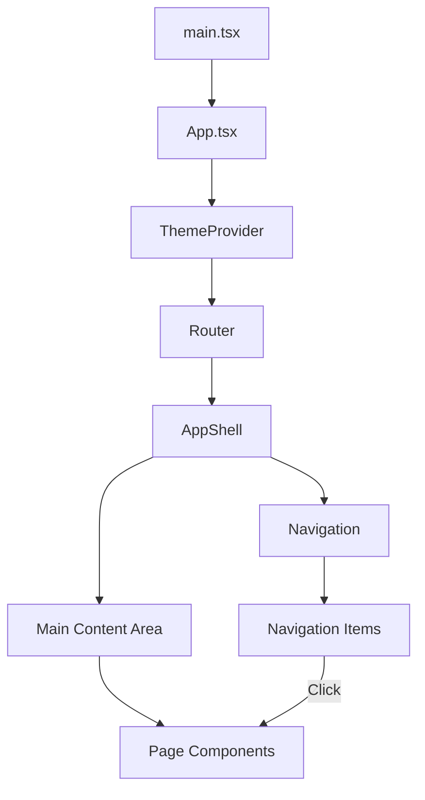

# Epic-1 - Story-1

PWA Project Setup and Infrastructure

**As a** developer
**I want** to set up the foundational React/TypeScript project with PWA capabilities and Material UI
**so that** I can build a responsive, installable disc golf training application with offline functionality

## Status

Completed

## Context

This is the first story in Epic-1 (PWA Foundation and Infrastructure). It involves setting up the development environment and implementing the core application structure that will support all future features. The application needs to be a Progressive Web App (PWA) to allow for installation on mobile devices and offline functionality, which is critical for use during practice sessions on disc golf courses where internet connectivity may be limited.

Material UI (MUI) will be used to implement Material Design principles as specified in the requirements, ensuring a consistent, modern, and mobile-friendly user interface. TypeScript will provide type safety and improved developer experience.

## Estimation

Story Points: 2

## Tasks

1. - [x] Initialize React/TypeScript Project
   1. - [x] Set up Vite with React and TypeScript template
   2. - [x] Configure ESLint and Prettier
   3. - [x] Set up directory structure according to architecture document
   4. - [x] Configure Git and initial commit

2. - [x] Implement PWA Capabilities
   1. - [x] Add manifest.json with app metadata
   2. - [x] Configure Workbox for service worker generation
   3. - [x] Set up offline caching strategies
   4. - [x] Implement install prompt handling

3. - [x] Set up Material UI (MUI)
   1. - [x] Install MUI packages and dependencies
   2. - [x] Create custom theme based on disc golf aesthetics
   3. - [x] Set up ThemeProvider and CSS baseline
   4. - [x] Implement responsive layout structure

4. - [x] Create Basic Application Shell
   1. - [x] Implement app shell component
   2. - [x] Set up basic navigation structure
   3. - [x] Create placeholder pages for main features
   4. - [x] Implement network status indicator

## Constraints

- Must use React 18+ with TypeScript 4.9+
- Material UI (MUI) v5+ must be used for consistent UI implementation
- The application must pass Lighthouse PWA audit with a score of 90+ 
- Mobile-first design approach is required
- All components must be responsive and work on both portrait and landscape orientations

## Data Models / Schema

```typescript
// Application theme type
interface AppTheme {
  primary: string;
  secondary: string;
  background: string;
  surface: string;
  error: string;
  text: {
    primary: string;
    secondary: string;
  };
  // Other theme properties
}

// Basic route definition
interface AppRoute {
  path: string;
  name: string;
  icon: React.ComponentType;
  component: React.ComponentType;
}
```

## Structure

Project will follow the structure outlined in the architecture document:

```
disc-golf-pwa/
├── public/              # Static assets
│   ├── icons/           # App icons for various sizes
│   ├── manifest.json    # PWA manifest file
│   └── serviceWorker.js # Service worker for offline capabilities
├── src/
│   ├── components/      # React components
│   │   ├── layout/      # App shell components
│   │   └── common/      # Reusable UI components
│   ├── theme/           # Material UI theme customization
│   │   └── theme.ts     # Custom theme definition
│   ├── pages/           # Main application views
│   ├── App.tsx          # Main application component
│   └── main.tsx         # Application entry point
├── index.html           # HTML entry point
├── package.json         # Project dependencies
└── vite.config.ts       # Vite configuration
```

## Diagrams



## Dev Notes

- ✅ Using `vite-plugin-pwa` to simplify PWA setup as documented in best practices
- ✅ MUI theme created with a color palette inspired by disc golf (greens, blues for nature elements)
- ✅ Set up React Router v6+ for navigation
- ✅ Implement lazy loading for page components to improve initial load performance (documented in best practices)
- ✅ Set up storage infrastructure for future API integrations with IndexedDB
- ✅ Browser compatibility for motion sensor APIs addressed in best practices document with permission handling for iOS 