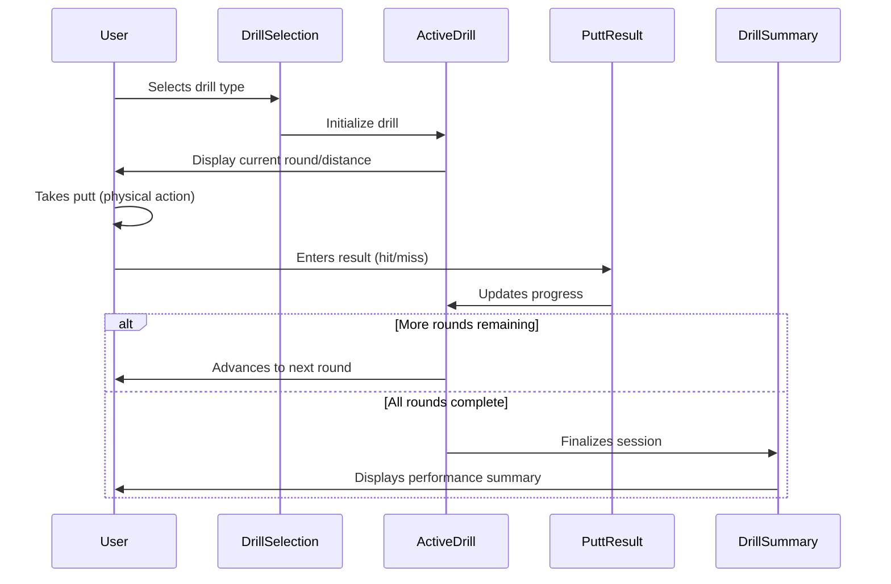
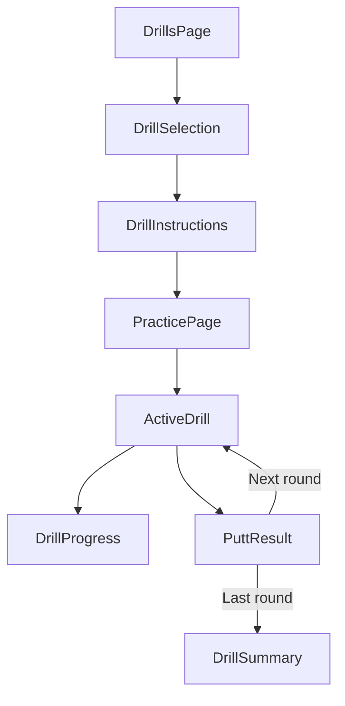

# Epic-2 - Story-1

Putting Drills Framework

**As a** disc golfer
**I want** structured putting practice drills with clear prompts and tracking
**so that** I can improve my putting technique through consistent, methodical practice

## Status

Completed

## Context

This is the first story in Epic-2 (Putting Practice Module). It focuses on building the core data structures and UI components for the putting practice drills. This includes implementing structured drills like "Circle 1X" (3-10m), "Circle 2" (10-20m), and the "5/5 Putts" game. These are fundamental to the application's primary purpose as a putting training tool.

The putting drills framework will provide the foundation for all practice activities in the app. Each drill type needs to be well-defined with parameters like distance ranges, number of attempts, and success criteria. The UI must guide users through drill sequences while maintaining their progress and statistics.

This story assumes that Epic-1 Story-1 (Project Setup) has been completed, providing the foundational application infrastructure.

## Estimation

Story Points: 3

## Tasks

1. - [x] Create Drill Data Models
   1. - [x] Define TypeScript interfaces for drill types
   2. - [x] Implement drill configuration data structures
   3. - [x] Create sample drill definitions for core types
   4. - [x] Set up drill selection mechanism

2. - [x] Implement "Circle 1X" Drill (3-10m)
   1. - [x] Create distance-based round generation
   2. - [x] Implement UI for drill introduction and instructions
   3. - [x] Build progress tracking through drill sequence
   4. - [x] Create make/miss input interface

3. - [x] Implement "Circle 2" Drill (10-20m)
   1. - [x] Configure for longer distance range
   2. - [x] Adjust UI for longer-distance specifics
   3. - [x] Implement stance variation options

4. - [x] Build "5/5 Putts" Game
   1. - [x] Create station-based sequence logic
   2. - [x] Implement consecutive makes tracking
   3. - [x] Build completion criteria and assessment

5. - [x] Create Drill Results Display
   1. - [x] Design summary view for completed drills
   2. - [x] Implement visualization of make/miss by distance
   3. - [x] Create sharable results format

## Constraints

- [x] Distance values must be displayed in both meters and feet
- [x] UI must be accessible on small mobile screens during active practice
- [x] Drill selection and configuration should be possible without internet connectivity
- [x] UI elements must be large enough to interact with comfortably during disc golf practice
- [x] All drill configurations must be stored locally for offline use

## Data Models / Schema

```typescript
// Drill type definition
interface DrillType {
  id: string;
  name: string;
  description: string;
  instructions: string;
  icon: string;
  minDistance: number; // In meters
  maxDistance: number; // In meters
  rounds: number;
  difficulty: 'beginner' | 'intermediate' | 'advanced';
}

// Drill attempt tracking
interface PuttAttempt {
  id: string;
  drillId: string;
  round: number;
  distance: number; // In meters
  stance: string;
  result: 'hit' | 'miss';
  timestamp: number;
  notes?: string;
}

// Drill session
interface DrillSession {
  id: string;
  drillTypeId: string;
  startTime: number;
  endTime?: number;
  completed: boolean;
  attempts: PuttAttempt[];
  summary?: {
    totalAttempts: number;
    madeAttempts: number;
    makePercentage: number;
  };
}
```

## Structure

New components and files to be created:

```
src/
├── components/
│   ├── drills/
│   │   ├── DrillSelection.tsx     # [x] Drill type selection screen
│   │   ├── DrillInstructions.tsx  # [x] Drill introduction and instructions
│   │   ├── ActiveDrill.tsx        # [x] Currently active drill interface
│   │   ├── DrillProgress.tsx      # [x] Progress through drill rounds
│   │   ├── PuttResult.tsx         # [x] Make/miss input component
│   │   └── DrillSummary.tsx       # [x] Completed drill results
│   └── common/
│       ├── DistanceDisplay.tsx    # [x] Shows distances in m/ft
│       └── StanceSelector.tsx     # [x] Stance variation options
├── types/
│   └── drills.ts                  # [x] Drill type definitions
├── services/
│   └── drillService.ts            # [x] Business logic for drills
└── pages/
    ├── DrillsPage.tsx             # [ ] Drill selection page (Handled by App routing)
    └── PracticePage.tsx           # [ ] Active practice page (Handled by App routing)
```

## Diagrams





## Dev Notes

- Drill configurations should be stored in a separate JSON file for easy updates
- Consider implementing a way for users to customize drill parameters in a future story
- Use Material UI Cards for drill selection with clear visual hierarchy
- Make/miss input should use large, thumb-friendly buttons for easy use while practicing
- Consider adding sound effects for successful putts (could be toggled in settings)
- The "5/5 Putts" game requires tracking consecutive makes—plan the state management carefully
- Diagram distances on a schematic basket view for better visualization 