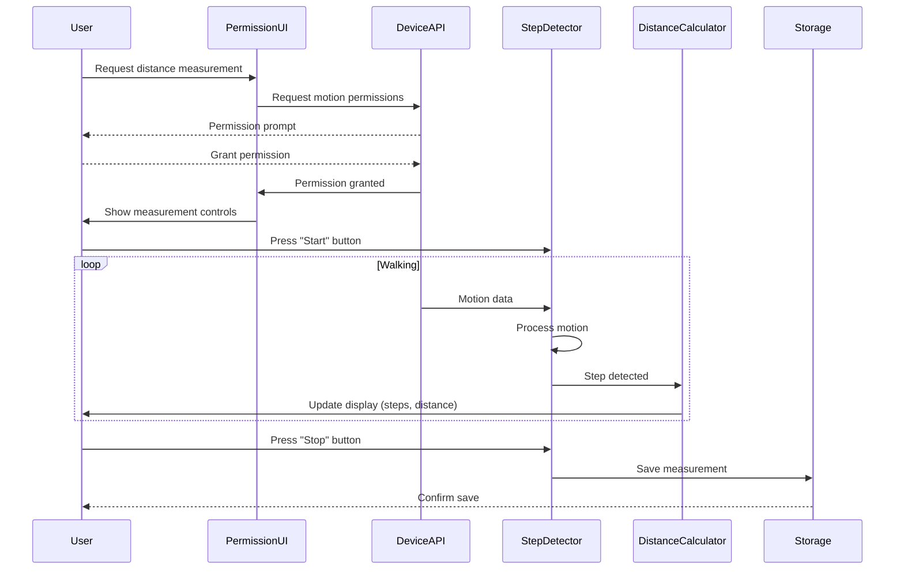
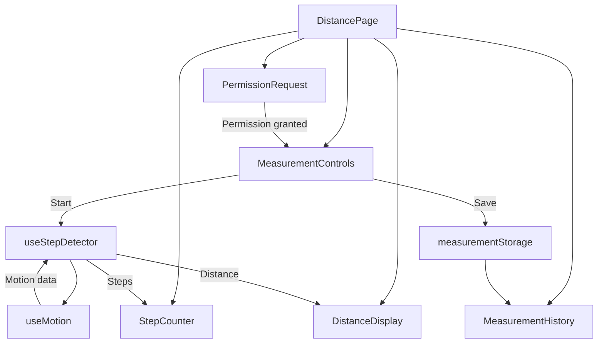

# Epic-3 - Story-1

Pedometer Implementation

**As a** disc golfer
**I want** to measure the distance to my lie using my device's sensors
**so that** I can accurately record putting distances during practice

## Status

Draft

## Context

This is the first story in Epic-3 (Distance Measurement Features). It focuses on implementing a pedometer-based distance measurement system using the device's motion sensors (accelerometer). This feature is critical because accurate distance measurement is fundamental to tracking putting performance by distance and for providing appropriate practice challenges.

The approach uses DeviceMotionEvent API to capture motion data, which requires user permission. The system will detect steps as the user walks from the basket to their disc (lie) and calculate the distance based on the user's calibrated stride length. This method was chosen over GPS for short-distance accuracy.

This story assumes that Epic-1 Story-1 (Project Setup) has been completed, providing the foundational application infrastructure.

## Estimation

Story Points: 4

## Tasks

1. - [ ] Implement Device Motion Access
   1. - [ ] Create permission request flow
   2. - [ ] Implement accelerometer data capture
   3. - [ ] Build error handling for unsupported devices
   4. - [ ] Set up motion event listeners

2. - [ ] Create Step Detection Algorithm
   1. - [ ] Implement motion pattern recognition
   2. - [ ] Apply threshold-based step detection
   3. - [ ] Add noise filtering for motion data
   4. - [ ] Build step counter with real-time updates

3. - [ ] Develop Stride Length Calibration
   1. - [ ] Create calibration UI
   2. - [ ] Implement calibration process flow
   3. - [ ] Store calibration data locally
   4. - [ ] Add manual stride length input option

4. - [ ] Build Distance Calculation Mechanism
   1. - [ ] Implement steps-to-distance conversion
   2. - [ ] Create meter-to-feet conversion
   3. - [ ] Add real-time distance display
   4. - [ ] Implement distance rounding/formatting

5. - [ ] Develop Measurement Control UI
   1. - [ ] Create start/stop/reset controls
   2. - [ ] Implement visual feedback during measurement
   3. - [ ] Build measurement history feature
   4. - [ ] Add option to apply measured distance to current drill

## Constraints

- Must work on iOS and Android browsers (no native app dependencies)
- Distance must be displayed in both meters and feet
- Must function without internet connectivity
- The UI must be usable while walking on a course
- Stride length calibration should persist between sessions
- Motion detection must be battery-efficient

## Data Models / Schema

```typescript
// User stride calibration
interface StrideCalibration {
  userId: string;
  strideLength: number; // in meters
  calibrationDate: number; // timestamp
  calibrationMethod: 'automatic' | 'manual';
}

// Step detection configuration
interface StepDetectionConfig {
  accelerationThreshold: number;
  timeThreshold: number;
  smoothingFactor: number;
}

// Measurement session
interface DistanceMeasurement {
  id: string;
  timestamp: number;
  steps: number;
  distanceMeters: number;
  distanceFeet: number;
  gpsCoordinates?: {
    latitude: number;
    longitude: number;
    accuracy: number;
  };
  notes?: string;
}
```

## Structure

New components and files to be created:

```
src/
├── components/
│   └── distance/
│       ├── PermissionRequest.tsx   # Motion sensor permission UI
│       ├── StepCounter.tsx         # Step counting display
│       ├── DistanceDisplay.tsx     # Distance measurement display
│       ├── MeasurementControls.tsx # Start/stop/reset buttons
│       ├── CalibrationWizard.tsx   # Stride length calibration
│       └── MeasurementHistory.tsx  # Previous measurements list
├── hooks/
│   ├── useMotion.ts                # Motion sensor access hook
│   └── useStepDetector.ts          # Step detection algorithm
├── services/
│   ├── pedometer/
│   │   ├── stepDetection.ts        # Step detection algorithm
│   │   ├── distanceCalculation.ts  # Distance calculation utilities
│   │   └── calibration.ts          # Calibration logic
│   └── storage/
│       └── measurementStorage.ts   # Store/retrieve measurements
├── types/
│   └── measurements.ts             # Measurement type definitions
└── pages/
    └── DistancePage.tsx            # Main distance meter page
```

## Diagrams





## Dev Notes

- Review accelerometer access on different browsers/devices—Safari has stricter permission requirements
- Consider implementing a "manual mode" fallback for devices without motion sensors
- Use low-pass filtering to improve step detection accuracy in varied walking conditions
- Pre-populated stride length estimates based on user height could be a helpful default
- The UI must clearly indicate the active measurement state (idle/measuring/paused)
- Battery consumption should be minimized by optimizing the motion event listener frequency
- Test the step detection algorithm with varied walking patterns and on different terrains
- Consider adding haptic feedback (via vibration API) when steps are detected 