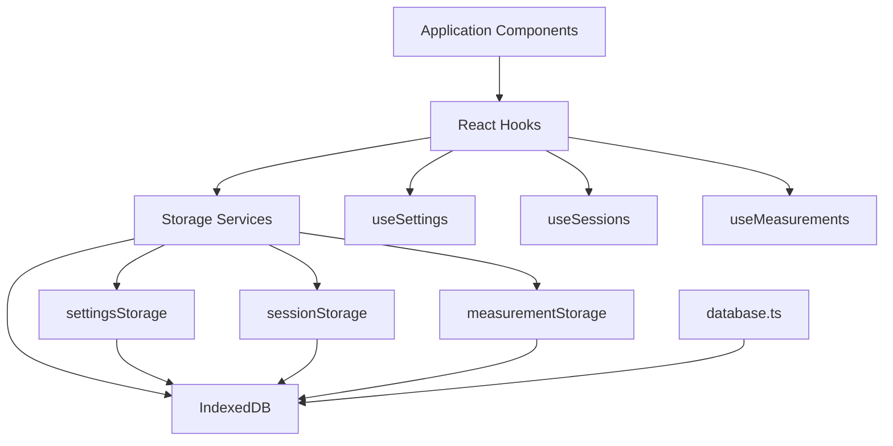
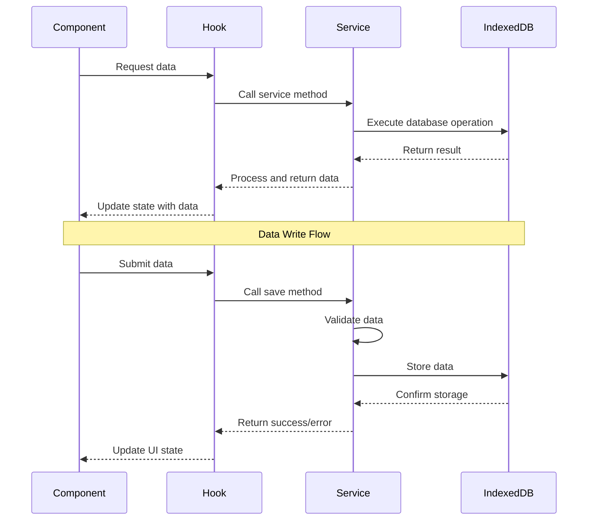

# Epic-4 - Story-1

Local Data Storage Implementation

**As a** disc golfer
**I want** my putting practice data to be stored locally on my device
**so that** I can access my statistics and continue training without internet connectivity

## Status

Draft

## Context

This is the first story in Epic-4 (Data Storage and Statistics). It focuses on implementing a local data storage system using IndexedDB to enable offline data persistence. This feature is critical because it allows users to record and track their putting practice sessions without requiring internet connectivity, which is essential for use on disc golf courses.

The storage system will handle user settings (like stride length calibration), putting sessions data, and distance measurements. It must be robust, performant, and handle potential browser storage limitations gracefully. The implementation will create the foundation for all data operations in the application.

This story assumes that Epic-1 Story-1 (Project Setup) has been completed, providing the foundational application infrastructure.

## Estimation

Story Points: 3

## Tasks

1. - [ ] Design IndexedDB Schema
   1. - [ ] Define object store structures
   2. - [ ] Determine indices for efficient querying
   3. - [ ] Create version upgrade path for future changes
   4. - [ ] Document schema design decisions

2. - [ ] Implement Database Initialization
   1. - [ ] Create database connection handling
   2. - [ ] Implement object store creation
   3. - [ ] Add error handling for database operations
   4. - [ ] Set up version migration mechanism

3. - [ ] Build CRUD Operations for Settings
   1. - [ ] Implement user settings storage
   2. - [ ] Create stride length calibration storage
   3. - [ ] Build preferences persistence
   4. - [ ] Add theme settings storage

4. - [ ] Implement Session Data Storage
   1. - [ ] Create putting session storage operations
   2. - [ ] Build attempt tracking persistence
   3. - [ ] Implement drill configuration storage
   4. - [ ] Add session summary calculations

5. - [ ] Develop Measurement Storage
   1. - [ ] Implement distance measurement persistence
   2. - [ ] Build measurement history retrieval
   3. - [ ] Create measurement filtering options
   4. - [ ] Add data export functionality

6. - [ ] Create Storage Service Abstraction
   1. - [ ] Implement service interfaces
   2. - [ ] Build React hooks for data access
   3. - [ ] Add loading/error state handling
   4. - [ ] Implement storage quota management

## Constraints

- Must function completely offline without server connectivity
- Data must persist across browser sessions and app restarts
- Storage operations must be performant, especially during active practice
- Must handle storage limitations gracefully with user feedback
- The interface must support future sync capabilities when backend is added

## Data Models / Schema

```typescript
// IndexedDB database structure
interface AppDatabase {
  name: string;
  version: number;
  objectStores: {
    settings: ObjectStore;
    sessions: ObjectStore;
    measurements: ObjectStore;
  };
}

// Object store definition
interface ObjectStore {
  name: string;
  keyPath: string;
  autoIncrement: boolean;
  indices: Index[];
}

// Index definition
interface Index {
  name: string;
  keyPath: string;
  options: {
    unique: boolean;
    multiEntry?: boolean;
  };
}

// Database query options
interface QueryOptions {
  store: string;
  index?: string;
  range?: IDBKeyRange;
  direction?: IDBCursorDirection;
  limit?: number;
}

// Database service result
interface StorageResult<T> {
  success: boolean;
  data?: T;
  error?: Error;
  timestamp: number;
}
```

## Structure

New components and files to be created:

```
src/
├── services/
│   └── storage/
│       ├── database.ts               # Database initialization
│       ├── storageService.ts         # Abstract storage service
│       ├── settingsStorage.ts        # User settings storage
│       ├── sessionStorage.ts         # Putting session storage
│       ├── measurementStorage.ts     # Distance measurement storage
│       └── migrationUtils.ts         # Schema migration utilities
├── hooks/
│   ├── useDB.ts                      # Database access hook
│   ├── useSettings.ts                # Settings access hook
│   ├── useSessions.ts                # Session data access hook
│   └── useMeasurements.ts            # Measurement data access hook
├── types/
│   └── storage.ts                    # Storage type definitions
└── utils/
    ├── storageUtils.ts               # Storage helper functions
    └── quotaUtils.ts                 # Storage quota management
```

## Diagrams





## Dev Notes

- Use Dexie.js or idb library to simplify IndexedDB interactions
- Consider implementing a caching layer for frequently accessed data
- Add data validation before storage to prevent corrupted entries
- Implement automatic data cleanup for old entries to manage storage quota
- Error handling should be robust with user-friendly messages
- Consider adding an import/export feature so users can backup their data
- Use transaction-based operations for related data updates to ensure consistency
- Structure the code to allow for future server synchronization
- Test with different browser storage limits and connection states
- Consider privacy implications and add clear instructions about stored data 