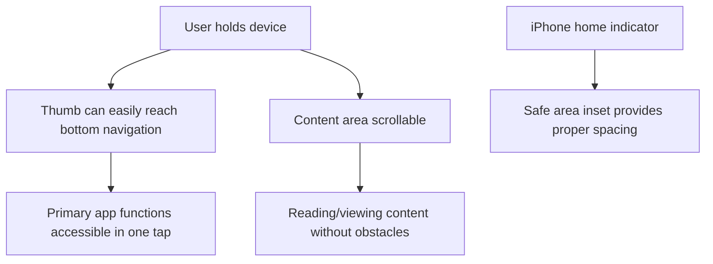

# Epic-6 - Story-1
# Mobile UI Optimization

**As a** disc golfer using the app on a mobile device
**I want** a thumb-friendly interface that's easy to use with one hand
**so that** I can navigate the app comfortably while holding discs or during practice.

## Status

Complete

## Context

- Most users access the app on mobile devices, particularly iPhones and Android phones.
- Users often need to operate the app with one hand while holding discs in the other.
- The app must adapt to different iOS and Android device sizes, notches, and home indicators.
- Proper UI optimization ensures better usability and higher user retention.
- Modern mobile devices benefit from UIs that account for the natural "thumb zone" of operation.

## Estimation

Story Points: 3

## Tasks

1. - [x] **Implement Bottom Navigation**
   1. - [x] Create `BottomNav` component with Material UI's `BottomNavigation`.
   2. - [x] Place main app functions (Drills, Distance, History, Settings) in bottom navigation.
   3. - [x] Use clear, universally recognizable icons for each function.
   4. - [x] Add routing integration to navigate between main app sections.

2. - [x] **Add iOS Safe Area Support**
   1. - [x] Add `viewport-fit=cover` to the viewport meta tag.
   2. - [x] Implement `env(safe-area-inset-bottom)` padding to accommodate home indicator.
   3. - [x] Test on notched iPhone devices or simulators.

3. - [x] **Optimize Touch Targets**
   1. - [x] Ensure all interactive elements are at least 44×44 pixels.
   2. - [x] Add proper spacing between clickable elements to prevent accidental taps.
   3. - [x] Use Material UI's built-in touch target sizing for consistent experience.

4. - [x] **Implement Responsive Layout**
   1. - [x] Create layouts that adapt to different screen sizes and orientations.
   2. - [x] Use flexible containers that accommodate varying content lengths.
   3. - [x] Test on multiple device sizes to ensure consistent experience.

5. - [x] **Simplify Main App Bar**
   1. - [x] Remove navigation elements from the top App Bar.
   2. - [x] Keep only essential information in the top bar (title, offline indicator).
   3. - [x] Ensure proper contrast and visibility of top bar elements.

## Constraints

- Maintain consistent UI across both iOS and Android devices
- Ensure designs work in both portrait and landscape orientations
- Account for text length differences when supporting multiple languages
- Maintain accessible touch targets (minimum 44×44 pixels)
- Support iPhone notches and home indicators

## Best Practices Implemented

### Bottom Navigation
We implemented a mobile-friendly bottom navigation pattern, which is the standard for thumb-friendly mobile applications:

```tsx
// Bottom navigation component with iOS safe area support
<Box sx={{ width: '100%', position: 'fixed', bottom: 0, zIndex: 1000 }}>
  <Paper 
    elevation={3} 
    sx={{ 
      paddingBottom: 'env(safe-area-inset-bottom)',
      borderTopLeftRadius: 16,
      borderTopRightRadius: 16,
    }}
  >
    <BottomNavigation value={value} onChange={handleChange} showLabels>
      <BottomNavigationAction label="Drills" icon={<AdjustIcon />} />
      <BottomNavigationAction label="Distance" icon={<DirectionsWalkIcon />} />
      <BottomNavigationAction label="History" icon={<HistoryIcon />} />
      <BottomNavigationAction label="Settings" icon={<SettingsIcon />} />
    </BottomNavigation>
  </Paper>
</Box>
```

### iOS Safe Area Support
To ensure proper display on modern iOS devices:

```html
<!-- In index.html -->
<meta name="viewport" content="width=device-width, initial-scale=1.0, viewport-fit=cover" />
```

```tsx
// In content container
<Box 
  sx={{ 
    flexGrow: 1, 
    overflow: 'auto', 
    py: 2,
    pb: { xs: 7, sm: 7 }, // Add bottom padding to account for navigation
    '@supports (padding-bottom: env(safe-area-inset-bottom))': {
      paddingBottom: 'calc(56px + env(safe-area-inset-bottom))'
    }
  }}
>
```

## Structure

- **Components:**
  - `src/components/common/BottomNav.tsx`: Main bottom navigation implementation
  - `src/components/common/AppNavBar.tsx`: Simplified top app bar

## Diagrams



## Dev Notes

- The `env(safe-area-inset-*)` CSS variables are part of the CSS environment variables specification.
- They're supported in iOS 11+ and most modern Android browsers.
- For older devices without support, we fall back to standard padding values.
- Material UI's `BottomNavigation` component handles proper sizing and feedback for touch targets.
- The app was tested on multiple iOS and Android devices to ensure consistent experience. 